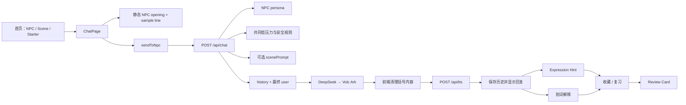

# 1. Executive Summary

Kotomachi 当前是一个功能完整度较高、产品边界清晰的 **Alpha / portfolio MVP**，仓库也记录了少量外部 beta 反馈；但它还不能被证据支持为“质量已验证的 Beta”或可持续使用的产品。它已实现 9 个公开 NPC、1 个隐藏 NPC、73 个 Guided Scenarios、混合语言聊天、表达提示、查词、收藏复习、回顾卡、记忆、TTS/STT 等能力，工程量与产品思考都明显超过普通聊天壳。

最大优势不是功能数量，而是“先输出、后学习”的分层设计：NPC 主聊天不主动纠错，用户主动打开提示、查词和复习；不同 NPC 也确有关系距离与 register 差异。Guided Scenario 的结构化内容和人工校准 Eval 是仓库里最有价值的 AI 产品资产。

最大问题是：**真实生产消息链与 Guided Eval 链不一致**。前端把当前用户消息同时放入 history，后端又追加一次，导致模型看到重复输入；`isFirstGuidedTurn` 也不会按评测条件触发。因此“73 个场景首轮回复达到 beta 水平”的结论没有覆盖真实浏览器路径。与此同时，场景没有持久的轮次、目标或自然收束，学习资产也没有重新回流到后续输出；产品拥有丰富功能，却尚未形成可验证的留存闭环。

最值得做的下一步是：先修生产链和 API 安全边界，再建立生产一致的 3–5 轮 Guided Eval 与最小行为数据闭环。最不该做的是继续增加 NPC、语言、世界观、RAG、Pronunciation Score 或更多学习卡片。

审计标记：**已验证事实**＝代码或仓库直接支持；**高置信推断**＝代码结构强烈指向但未做运行验证；**待确认**＝需要真实用户、部署或音频试听数据。

# 2. Repository Truth Map

## 2.1 仓库基线

- **已验证事实**：仓库根目录为 `D:\LucasRan\AI\kotomachi`。
- 分支：`main`；HEAD：`ff06b45`；与 `origin/main` 对齐。
- 工作区 clean，无 staged 或 unstaged 内容。
- 289 个 commits，时间跨度为 2026-05-26 至 2026-06-29，基本为单人 ownership。
- 技术栈：Next.js 14、React 18、TypeScript strict、Tailwind、OpenAI SDK、DeepSeek、火山方舟、火山语音、Edge TTS、Vercel Analytics。[package.json](</D:/LucasRan/AI/kotomachi/package.json:5>)
- 没有 test/eval npm script、测试框架或 `.test/.spec` 文件。
- 本次未运行 build、lint、真实 provider 或浏览器测试。

## 2.2 真实功能地图

| 区域 | 实际状态 | 核心文件 |
|---|---|---|
| 首页 | Hero、世界氛围、公开 NPC、每日场景、自由话题、继续聊天、Saku 彩蛋 | [首页](</D:/LucasRan/AI/kotomachi/app/page.tsx:41>)、[SceneEntrySection](</D:/LucasRan/AI/kotomachi/components/home/scene-entry-section.tsx:144>)、[InspirationSection](</D:/LucasRan/AI/kotomachi/components/home/inspiration-section.tsx:54>) |
| NPC 聊天 | 9 个公开 NPC，非法 ID 静默回落到 Misaki | [ChatPage](</D:/LucasRan/AI/kotomachi/app/chat/[npcId]/page.tsx:311>)、[NPC 配置](</D:/LucasRan/AI/kotomachi/lib/npc.ts:1>) |
| Hidden NPC | Saku 可通过夜间 rumor / 隐藏热点发现 | [RumorEntry](</D:/LucasRan/AI/kotomachi/components/home/rumor-entry.tsx:135>) |
| Guided Scenario | 73 个结构化场景；NPC 静态开场、sample line 预填、scene prompt、手动退出 | [场景配置](</D:/LucasRan/AI/kotomachi/lib/conversation-scenes.ts:3>)、[启动逻辑](</D:/LucasRan/AI/kotomachi/app/chat/[npcId]/page.tsx:1133>) |
| 主聊天 AI | DeepSeek 主 provider，Volc Ark 顺序 fallback | [Chat API](</D:/LucasRan/AI/kotomachi/app/api/chat/route.ts:603>)、[LLM provider](</D:/LucasRan/AI/kotomachi/lib/llm.ts:211>) |
| 表达扶手 | 发送前“我想说……”、发送后 Expression Hint、下一句建议 | [Pre-send API](</D:/LucasRan/AI/kotomachi/app/api/pre-send-expression/route.ts:144>)、[Feedback API](</D:/LucasRan/AI/kotomachi/app/api/feedback/route.ts:934>) |
| 查词与收藏 | 选中文本查词、自动记录 lookup、手动收藏、复习、mastered、笔记 | [WordPopover](</D:/LucasRan/AI/kotomachi/components/word-popover.tsx:90>)、[Saved Items](</D:/LucasRan/AI/kotomachi/lib/saved-items.ts:21>) |
| 回顾卡 | 最近对话、lookup、hint、混合语言 span 生成复习资产 | [Summary API](</D:/LucasRan/AI/kotomachi/app/api/session-summary/route.ts:1017>)、[Summary schema](</D:/LucasRan/AI/kotomachi/lib/session-summary.ts:68>) |
| Memory | 每 NPC durable facts、可见可删、4 条用户消息触发 curator、welcome merge | [Memory](</D:/LucasRan/AI/kotomachi/lib/memory.ts:207>)、[Memory API](</D:/LucasRan/AI/kotomachi/app/api/memory/route.ts:266>) |
| TTS | 火山优先、Edge fallback、voice profile、文本 normalization、前端 session cache | [TTS API](</D:/LucasRan/AI/kotomachi/app/api/tts/route.ts:37>)、[Voice profile](</D:/LucasRan/AI/kotomachi/lib/tts-voice-profiles.ts:3>) |
| STT | MediaRecorder、火山按 ja→en→zh 尝试、转录后进入输入框确认 | [录音链](</D:/LucasRan/AI/kotomachi/app/chat/[npcId]/page.tsx:1208>)、[STT provider](</D:/LucasRan/AI/kotomachi/lib/volcengine.ts:346>) |
| Voice Advice | API、类型与文档存在，但没有产品 UI 调用 | [Voice Advice API](</D:/LucasRan/AI/kotomachi/app/api/voice-advice/route.ts:480>) |
| 数据分析 | 只有自动 pageview Analytics，没有功能事件 | [Layout](</D:/LucasRan/AI/kotomachi/app/layout.tsx:36>) |

## 2.3 核心调用链

生产消息数组实际为：

1. NPC persona system。
2. shared baseline + safety system。
3. 可选 scene system。
4. 客户端传入的 history。
5. 后端再追加 `{ role: "user", content: text }`。[组装位置](</D:/LucasRan/AI/kotomachi/app/api/chat/route.ts:740>)

## 2.4 数据与状态

- `kotomachi_history_${npcId}`：每 NPC 最后 20 条，无 schema version/元素校验。[memory.ts](</D:/LucasRan/AI/kotomachi/lib/memory.ts:453>)
- `kotomachi_facts_${npcId}`：最多 10 条字符串 facts。
- `kotomachi_count_${npcId}`：消息计数。
- `kotomachi_last_time_${npcId}`：上次聊天时间。
- `kotomachi_arc_${npcId}`：NPC life arc 偏移。
- `kotomachi_saved_items_v1`：收藏词、表达、回顾卡引用，最多 200。
- `kotomachi.summaryCards.v1`、`wordLookups.v1`、`expressionHints.v1`：各自独立 schema。
- active Guided Scene 只在 React state，刷新后丢失。[ChatPage](</D:/LucasRan/AI/kotomachi/app/chat/[npcId]/page.tsx:353>)
- 语音 blob 仅当前页面存在，不写 LocalStorage，这是正确的隐私与生命周期判断。

## 2.5 文档与代码一致性

| 文档说法 | 代码事实 | 判断 |
|---|---|---|
| README：8 个 NPC | 9 个公开 NPC + Saku，共 10 个 | 过期。[README](</D:/LucasRan/AI/kotomachi/README.md:85>) |
| 首页规范：Continue 在 Inspiration 前 | 代码为 Inspiration → Continue | 已漂移。[规范](</D:/LucasRan/AI/kotomachi/docs/homepage-architecture-spec.md:36>)、[代码](</D:/LucasRan/AI/kotomachi/app/page.tsx:88>) |
| Guided Eval：beta acceptable | 只评 `opening → prefill → response1`，且采样 payload 与浏览器 payload 不同 | 结论范围过宽。[回顾](</D:/LucasRan/AI/kotomachi/docs/eval/guided-scenario-response-eval-v10-retrospective.md:20>) |
| REG-VOICE-004：TTS/STT timeout Fixed | 当前 Volc TTS/STT 和 Edge TTS 无超时 | 错误状态。[Regression](</D:/LucasRan/AI/kotomachi/docs/regression-cases.md:395>) |
| “safe prompt injection implemented” | in-app curator 有过滤，但 `/api/chat` 仍直接信任客户端 memories/history/system role | 只部分成立。[计划](</D:/LucasRan/AI/kotomachi/docs/development-plan.md:54>) |
| Eval calibration plan 仍是待执行 | 本地 `.tmp` 已存在 8-case comparison，但没有纳入版本控制 | 文档状态落后、结果不可复现 |
| README Demo | 仍是截图/GIF TODO | 作品集展示未完成。[README](</D:/LucasRan/AI/kotomachi/README.md:19>) |
| System Map | 主要调用链基本准确 | 值得保留；但指向了一些被 `.gitignore` 排除的 local eval 脚本 |

# 3. Top Findings

成本口径：XS＜1 天；S＝1–2 天；M＝3–5 天；L＝1–2 周。

## F1. 付费 AI/语音 API 没有真正的服务端访问边界

- **发现与证据**：Alpha code 使用 `NEXT_PUBLIC_ALPHA_ACCESS_CODE`，在客户端比较并写 LocalStorage，code 会进入浏览器 bundle。[Alpha gate](</D:/LucasRan/AI/kotomachi/app/alpha-access-gate.tsx:12>) 扫描 12 个 API route 未发现统一 auth、签名 session、rate limit 或 quota。
- **严重度·对象·后果**：**Critical**；部署者、成本与用户隐私。若线上配置了 provider 凭证，调用者可绕过首页直接请求 `/api/chat`、TTS、STT、feedback 等。
- **根因与建议**：把 UI gate 当成了 API gate。改为服务端 secret 验证并签发 httpOnly signed session；所有付费 API 校验 session，配置平台级速率限制、provider 配额和输入上限。
- **成本·回归风险·置信度**：M；访问/部署回归高；**高置信推断**，待确认线上是否公开且已配置 provider。

## F2. 真实聊天会把当前用户消息发送给模型两次

- **发现与证据**：前端先把当前消息 push 到 `historyForApi`，[ChatPage](</D:/LucasRan/AI/kotomachi/app/chat/[npcId]/page.tsx:983>)；API 又在 history 后追加同一 `text`。[Chat API](</D:/LucasRan/AI/kotomachi/app/api/chat/route.ts:765>)
- **严重度·对象·后果**：**Critical**；所有聊天用户、Prompt/Eval。模型看到重复输入，可能复述、过度回应、权重异常，并增加 token。
- **根因与建议**：当前消息归属没有单一契约。规定 history 永远不包含本轮 user，或 API 不再追加；增加 deterministic payload test，断言最终用户消息只出现一次。
- **成本·回归风险·置信度**：S；聊天历史回归高；**已验证事实**。

## F3. Guided 首轮规则在生产路径下无法按 Eval 条件触发

- **发现与证据**：API 用 `history.length <= 1` 判断首轮，[Chat API](</D:/LucasRan/AI/kotomachi/app/api/chat/route.ts:650>)；浏览器首轮 history 至少包含 scene opening + 当前 user，因此长度为 2。采样器只放 opening，再把 user 单独作为 text。
- **严重度·对象·后果**：**High**；Guided 用户、Prompt 质量。专门防止过早收场的首轮规则在真实路径失效。
- **根因与建议**：Eval 只验证 sampler→route，没有验证 browser→route。修 F2 后，把真实 payload assembly 抽成可复用函数，评测和前端共同使用。
- **成本·回归风险·置信度**：S；Guided 回归高；**已验证事实**。

## F4. “73 场景 beta 可接受”没有覆盖真实 3–5 轮体验

- **发现与证据**：v10 的评测单位明确只有 `npcOpening → sampleUserLineJa → npcResponse1`，[Retrospective](</D:/LucasRan/AI/kotomachi/docs/eval/guided-scenario-response-eval-v10-retrospective.md:22>)，却把目标表述为 3–5 轮。39/73 为 R3，仍有 16 个 `too_closed`、6 个弱 hook。[结果](</D:/LucasRan/AI/kotomachi/docs/eval/guided-scenario-response-eval-v10-retrospective.md:155>)
- **严重度·对象·后果**：**High**；产品判断、roadmap、作品集可信度。首轮高分不能证明用户会发第二、三句或自然结束。
- **根因与建议**：把易采样的 turn quality 代替了 episode outcome。保留 73 首轮集，但增加 12–20 条生产一致的 3–5 轮 episode eval、场景漂移和收束指标。
- **成本·回归风险·置信度**：M；Eval 规则回归中；**已验证事实**。

## F5. Guided Scenario 是丰富配置，不是完整 episode system

- **发现与证据**：配置含 `userGoal / possibleBeats / usefulIntents / softLanding`，[scene schema](</D:/LucasRan/AI/kotomachi/lib/conversation-scenes.ts:17>)；主 chat prompt 只使用 title、setup、intent、moment、avoid，[buildScenePrompt](</D:/LucasRan/AI/kotomachi/app/api/chat/route.ts:504>)。active scene 不持久、无 turn count、进度、完成或自动 soft landing，只能手动退出。
- **严重度·对象·后果**：**High**；快速场景练习用户。场景开始后仍像普通聊天，无法保证 3–5 轮有意义输出。
- **根因与建议**：内容 schema 领先于运行状态。新增极轻量 episode state：sceneId、startedAt、userTurnCount、phase、endedReason；不做任务 UI，只用于 Prompt、自然收束和数据。
- **成本·回归风险·置信度**：M/L；对话自然度回归高；**已验证事实**。

## F6. 产品无法回答最核心的行为问题

- **发现与证据**：仅挂载 `<Analytics />`，没有 `track()` 或 feature event。[Layout](</D:/LucasRan/AI/kotomachi/app/layout.tsx:39>) 体验日志记录了少量 external beta feedback，但没有参与人数、session、漏斗或变化前后数据。[Experience Log](</D:/LucasRan/AI/kotomachi/docs/experience-log.md:86>)
- **严重度·对象·后果**：**High**；产品负责人、实验与 roadmap。无法判断第一句发送率、3 轮率、Guided 增益、工具使用、回访和学习资产复用。
- **根因与建议**：功能开发快于验证。先采 10–12 个无内容事件，并做 5–10 人任务观察；禁止采原始消息和音频。
- **成本·回归风险·置信度**：M；隐私风险中；**已验证事实**。

## F7. 每条 NPC 回复都自动生成 TTS，并阻塞文本出现

- **发现与证据**：`useVoice = true`，等待 `fetchTtsUrl` 后才构建并显示 assistant message。[ChatPage](</D:/LucasRan/AI/kotomachi/app/chat/[npcId]/page.tsx:1033>) 输入框在整个期间 disabled。[输入框](</D:/LucasRan/AI/kotomachi/app/chat/[npcId]/page.tsx:2437>) TTS 响应明确 `no-cache`。[TTS API](</D:/LucasRan/AI/kotomachi/app/api/tts/route.ts:118>)
- **严重度·对象·后果**：**High**；所有用户、延迟与费用。即使用户不播放语音也会付费并等待；TTS 故障拖慢文本聊天。
- **根因与建议**：把语音资产生成当作回复完成条件。先显示文本并解锁输入；TTS 改为按需或后台预取，失败不能影响聊天。
- **成本·回归风险·置信度**：M；音频状态回归高；**已验证事实**。

## F8. 音频当前最关键的问题是可靠性与交互，不是继续挑声线

- **发现与证据**：Volc TTS、STT 和 Edge stream 无 AbortSignal/timeout；录音 permission await 存在“用户已松手但 recorder 后启动”的 race；mp4 被标成 mp3、webm 被标成 ogg 但没有转码。[录音](</D:/LucasRan/AI/kotomachi/app/chat/[npcId]/page.tsx:1213>)、[格式映射](</D:/LucasRan/AI/kotomachi/lib/volcengine.ts:249>)。STT 还会把所有拉丁词小写化。[后处理](</D:/LucasRan/AI/kotomachi/lib/volcengine.ts:265>)
- **严重度·对象·后果**：**High**；移动端和混合语言用户。首次录音、Safari mp4、JLPT/AI/ChatGPT 等专有词可能失败或失真。
- **根因与建议**：浏览器容器格式、provider codec 和 UI gesture 生命周期没有统一契约。先加 timeout、permission cancellation、最长录音、真实容器支持/转码策略，移除破坏性 lowercase。
- **成本·回归风险·置信度**：M；跨浏览器回归高；格式失败为**高置信推断**，需真机验证。

## F9. 首页内容丰富，但首屏没有清楚说“这是什么、我该做什么”

- **发现与证据**：Hero 只有品牌、时间与氛围，[首页](</D:/LucasRan/AI/kotomachi/app/page.tsx:46>)；随后是 9 NPC、featured scene、9 个自由话题，Continue 最后出现且最多只显示 1 个。[Continue](</D:/LucasRan/AI/kotomachi/components/home/continue-section.tsx:42>)
- **严重度·对象·后果**：**High**；首次用户和回访用户。新用户面对多个相似入口，回访用户的主任务反而被埋底。
- **根因与建议**：首页同时承担世界观、NPC 展示、场景推荐、话题推荐和恢复会话。首屏补一句明确价值；有历史时把 Continue 提到 Scene 前；默认只显示一个主要场景和少量 NPC。
- **成本·回归风险·置信度**：S/M；视觉层级回归中；**高置信推断**，未做截图/可用性测试。

## F10. 学习工具形成了资产库，但没有形成“资产重新进入输出”的闭环

- **发现与证据**：收藏支持 review/mastered/notes，回顾卡也有 `nextTalkPrompt`；但主聊天 payload 只注入 memories，不注入 saved words/expressions/review history。[send payload](</D:/LucasRan/AI/kotomachi/app/chat/[npcId]/page.tsx:1028>) 没有检测收藏词是否重新出现在用户输出。
- **严重度·对象·后果**：**High**；学习工具用户与留存。收藏、复习和聊天成为并行系统，无法证明学习资产提升了表达。
- **根因与建议**：闭环停在“保存/看过”。先做一个小实验：从最近收藏中生成可编辑的下一次开场，或在本地检测后续输出是否复用了某个资产，只上报 boolean。
- **成本·回归风险·置信度**：M；可能增加学习压力，回归中；**已验证事实**。

## F11. `/api/chat` 信任客户端提供的角色、上下文和长度

- **发现与证据**：request 直接接受 `ChatCompletionMessageParam[]`、memories、lifeArc、worldDescription 等，[类型](</D:/LucasRan/AI/kotomachi/app/api/chat/route.ts:21>)；随后原样插入 messages。[组装](</D:/LucasRan/AI/kotomachi/app/api/chat/route.ts:765>) text、history 内容和总长度没有上限，history 也可包含 system/tool role。
- **严重度·对象·后果**：**High**；Prompt 安全、费用与稳定性。调用者能插入额外 system message、构造巨型上下文或伪造世界/记忆。
- **根因与建议**：服务端类型断言代替运行时校验。只接受 user/assistant、截断每条和总条数；npc/scene 必须验证匹配；日期、世界和 familiarity 在服务端计算。
- **成本·回归风险·置信度**：M；旧 payload 回归高；**已验证事实**。

## F12. LocalStorage 是合理 MVP 选择，但当前 schema 与清理边界已开始失控

- **发现与证据**：history 只检查 array，不校验元素；Saved Items key 带 v1 但 load 同样只检查 array。[Saved Items](</D:/LucasRan/AI/kotomachi/lib/saved-items.ts:96>) “重新开始”清 history/facts/time，但不清 `kotomachi_count_*`，[reset helper](</D:/LucasRan/AI/kotomachi/lib/memory.ts:493>)，导致新欢迎仍可能带熟悉度。
- **严重度·对象·后果**：**Medium/High**；回访用户、数据迁移、隐私。损坏旧数据可污染 UI；“重新开始”语义不一致；用户没有一键导出/删除全部本地数据。
- **根因与建议**：每项功能自行增加 key。先建小型 storage registry、runtime parser 和迁移入口；明确 reset chat、delete memory、delete all 三种语义。
- **成本·回归风险·置信度**：M；历史数据回归高；**已验证事实**。

## F13. 集成点和 Prompt 已达到高改动扩散风险

- **发现与证据**：ChatPage 2618 行、SavedItemsPanel 2181 行、ChatBubble 1544 行、conversation-scenes 3254 行。ChatPage 有 40+ state/ref；persona 又在 chat 与 welcome 重复维护。Aoi 在 `buildSystemPrompt` 有一套 Prompt，[Aoi branch](</D:/LucasRan/AI/kotomachi/app/api/chat/route.ts:224>)，运行时又由另一套专用 Prompt 覆盖。[runtime Aoi](</D:/LucasRan/AI/kotomachi/app/api/chat/route.ts:688>)
- **严重度·对象·后果**：**Medium/High**；后续维护者、Prompt Lead。改一处可能没有生效，状态变更容易影响音频、场景、回顾、记忆和欢迎。
- **根因与建议**：功能连续叠加在原集成组件。不要重写；先抽 `buildChatPayload`、`useChatSession`、`useVoiceInput`、Prompt registry 和 scene session reducer。
- **成本·回归风险·置信度**：L，分步实施；回归高；**已验证事实**。

## F14. 输出与失败路径没有保护核心产品契约

- **发现与证据**：主聊天只取 `aiText` 并返回，无 Japanese ratio、长度、emoji、teacher-tone 或空字符串校验。[Chat API](</D:/LucasRan/AI/kotomachi/app/api/chat/route.ts:818>) 前端清理会删除所有括号/方括号内容，而非只识别动作描写。[sanitize](</D:/LucasRan/AI/kotomachi/app/chat/[npcId]/page.tsx:157>) 失败 fallback 带 emoji，且失败 turn 不保存。[错误路径](</D:/LucasRan/AI/kotomachi/app/chat/[npcId]/page.tsx:1051>)
- **严重度·对象·后果**：**Medium/High**；异常输入和 provider 故障用户。可出现空回复、非日语回复、合法括号内容丢失、刷新后失败 turn 消失。
- **根因与建议**：核心契约只写在 Prompt，没有 deterministic guard。增加轻量 post-check 与不破坏原文的 fallback；失败消息和重试操作要明确，不伪装成正常 NPC 回复。
- **成本·回归风险·置信度**：S/M；日语文本误判风险中；**已验证事实**。

## F15. 移动可用性、文档证据和作品集呈现仍不够专业

- **发现与证据**：根 `<html lang="ja">`，但 UI 默认中文；大量 8–10px 文本、36×36 主控件，[输入控件](</D:/LucasRan/AI/kotomachi/app/chat/[npcId]/page.tsx:2210>)；多个 overlay 缺 `role="dialog"`、focus trap 和 Escape，例如 Saved Items。[overlay](</D:/LucasRan/AI/kotomachi/components/saved-items-panel.tsx:1785>) 英文 UI 的 active scene 仍显示中文 `title/setup`。[scene card](</D:/LucasRan/AI/kotomachi/app/chat/[npcId]/page.tsx:2062>) README 没有 demo 图片。
- **严重度·对象·后果**：**Medium**；移动端、键盘/辅助技术用户、招聘方。产品显得功能多但完成度不稳定。
- **根因与建议**：组件局部 polish 多，端到端 accessibility 和 portfolio evidence 少。做一次真机/桌面任务截图审计，统一对话框语义、字号、点击区、语言与 README 证据。
- **成本·回归风险·置信度**：M；视觉回归中；代码事实已验证，实际可见严重度**待浏览器确认**。

# 4. User Journey Audit

## 4.1 首次用户

**有效设计**

- Guided Scene 和 starter 都能预填而不自动发送，保留用户 ownership。
- 进入场景由 NPC 先开口，显著优于空白输入框。
- 聊天页有一次性 onboarding card。
- 多种输入语言可进入，NPC 仍被要求使用日语。

**关键断点**

1. Hero 没有立刻解释“低压力日语输出练习”。
2. NPC、日常场景、今日场景、随便聊一句是多个相似入口。
3. 9 个 NPC 的 register 差异虽然存在，但首次用户需要读大量小字才能理解。
4. 进入聊天后可能先等待 welcome；核心输入区与多个辅助入口同时出现。
5. 系统没有询问“你想随便聊，还是练一个具体场景”。

**判断**：启动扶手很多，但首页没有替用户做第一次选择。

## 4.2 回访用户

**有效设计**

- 按 NPC 保存聊天、上次时间和记忆。
- 两小时后可生成 revisit welcome。
- 首页能恢复最近一次聊天。
- NPC life arc、world context 和 memory 试图制造连续感。

**关键断点**

- Continue 被放在首页最底部，只显示 1 个最近 NPC。
- revisit welcome 是额外 LLM 调用，也可能让用户觉得 NPC 自说自话。
- “重新开始”不清 familiarity count。
- 收藏和回顾没有自然成为回访任务。
- 当前没有证据说明 life arc/world state 被用户注意到或促成留存。

**判断**：有恢复能力，但没有被验证的第二周回访理由。

## 4.3 Guided Scenario 用户

**有效设计**

- 73 个场景覆盖点单、校园、职场、生活支援、旅行、运动和 mystery。
- scene query、NPC-first opening、editable sample line 都已实现。
- Prompt 明确避免任务/考试化。

**关键断点**

- 当前 user 重复进入 Prompt，首轮规则失效。
- scene state 刷新即丢。
- 新场景 opening 直接追加到旧聊天，旧话题仍在 history。
- 无 3–5 轮 episode phase、完成或 soft landing。
- `softLanding` 等字段没有进入主 chat prompt。
- 场景一直 active，直到用户手动退出。

**判断**：入口体验接近产品，后续多轮仍是普通聊天加 scene label。

## 4.4 学习工具用户

**有效设计**

- 主聊天与教学层分离，是最强产品决策。
- Expression Hint 为用户主动触发，分 casual/neutral/polite。
- 查词有读音、句义、语感和来源。
- 收藏复习支持筛选、review count、mastered 和 notes。
- Review Card 能利用 lookup/hint 作为强信号。

**关键断点**

- 学习入口很多：Hint、translate、lookup、pre-send、next line、save、review、summary。
- 收藏项来源上下文不够清楚，仓库也已记录该问题。
- 资产没有进入下一次聊天输出。
- 当前无法知道哪种工具真正帮助了用户，哪种只是被打开。
- SavedItemsPanel 过于复杂，可能把轻量练习变成管理学习数据库。

**判断**：学习资产生成强于学习资产复用。

## 4.5 混合语言与错误用户

- 中英日混合输入是明确支持的，Chat Prompt 也要求日语回复。
- Pre-send 和 Expression Hint 有大量混输 normalizer/fallback。
- 但主聊天没有输出 contract check。
- STT 会错误 lower-case 拉丁词。
- 对 AI 回复不满意时没有 regenerate、dislike、report bad case 或“换一种更短回复”；只有 Expression Hint 可重生成。
- 网络失败同时出现 error banner 和伪 NPC fallback bubble，且 fallback 带 emoji。

## 4.6 移动端

静态代码判断的五个最大风险：

1. 首次麦克风权限期间松手可能产生录音 race。
2. 麦克风/+ 按钮为 36px，低于常见 44px 触控建议。
3. 大量 8–10px 文案和低 opacity secondary text。
4. 文本 selection、查词 popover 在移动端本身难操作。
5. 多层 fixed menu、drawer、soft keyboard 和 safe-area 可能互相挤压；多数 overlay 缺 focus/Escape 管理。

## 4.7 桌面端

- 固定 sidebar、宽聊天区、右侧 drawer 比移动端更适合管理收藏和回顾。
- 但首页仍大量使用横向滚动 rail，在宽屏上信息层级不够聚焦。
- 侧栏、+ 菜单和气泡操作共同暴露很多能力，长期用户可能形成“到处都是工具”的疲劳。

## 4.8 五类 UX 结论

**首次最可能困惑的 5 点**

1. 这是聊天产品、口语产品还是收藏复习产品？
2. SceneEntry 和“今日街角小事”有什么区别？
3. 应该先选 NPC 还是先选场景？
4. “我想说”“下一句怎么接”“表达提示”分别发生在什么时候？
5. NPC 为什么自动说话/自动生成语音？

**高频用户最可能厌烦的 5 点**

1. 每轮都等 TTS 才看到文字。
2. 回复期间不能提前输入下一句。
3. 首页继续聊天入口太低。
4. revisit welcome 不一定是用户想要的。
5. 收藏、回顾和筛选逐渐变成管理负担。

**看起来精致但当前价值较低**

- 隐藏 Saku 热点和彩蛋。
- 每日伪随机 world weather/life arc。
- 73 个场景的数量扩张。
- PWA install guidance。
- 过多学习卡内部标签和层级。

**小改动高收益**

- Hero 增加一行明确定位和单一主 CTA。
- 有历史时把 Continue 提到第一内容区。
- 修复消息重复，让回复文字先显示。
- chat busy 时仍允许用户在输入框起草。
- 统一 44px 控件、12px 以上辅助文本。
- active scene 用本地化 title/microEpisode，而非中文 setup。

# 5. AI / Prompt Audit

## 5.1 当前消息链

- Persona system：NPC 身份、语体、关系距离、memory、日期、life arc、邻居与世界状态。
- Shared system：低压力、先回应用户、不要教学/建议机，以及较长的世界安全规则。
- Scene system：场景 title/setup/intent/moment/avoid 和首轮 continuation 规则。
- History：客户端提供。
- Final user：服务端追加。

主要问题不是“scenePrompt 丢失”。本地 runtime snapshot 已证明 scenePrompt 会到达 provider；真正问题是：

1. 浏览器 payload 和 sampler payload 不一致。
2. persona/shared/scene 约束竞争。
3. Prompt 过长且重复。
4. 没有输出端 contract。
5. 没有 Prompt version 或 production trace。

## 5.2 Prompt 架构风险

| 风险 | 类型 | 判断 |
|---|---|---|
| 当前 user 重复 | 工程/Prompt assembly | 确定性 bug，不是模型问题 |
| Aoi 两套 Prompt | 工程/维护 | 修改旧 branch 可能完全无效 |
| Welcome 单独维护 NPC_PERSONALITIES | 工程/角色漂移 | chat 与 welcome 可产生不同角色 |
| Shared safety 超长 | Prompt | 规则竞争和 token 成本增加 |
| 大量禁止项 | Prompt | 能压坏例，但可能让回复过度保守/too closed |
| 任意 history/system role | 安全/工程 | 可绕过原始 system 优先级 |
| 无 Prompt version | 质量治理 | 无法把 bad case 绑定到具体版本 |
| 无 provider/model/usage 返回 | 数据/工程 | 无法分辨 Prompt、模型、provider 与延迟问题 |
| 无输出校验 | 产品/工程 | Prompt 失效后没有第二层保护 |

## 5.3 NPC 差异化判断

**差异不是只有头像**。Aoi 的同龄 casual、Haruka 的轻丁寧前辈、Kimura 的便利店距离、Taisho 的年长熟客、Mao 的轻职场、Riku 的运动伙伴、Nana 的生活支援、Ren 的旅行观察、Saku 的轻神秘，都有行为规则和禁止漂移。

但差异仍有三个上限：

- 大多数 NPC 共享“短句→回应→问一个小问题”的行为骨架。
- Practical NPC 容易滑向客服/顾问；v10 中 Nana 仍最弱，平均 23.13。
- 没有多轮 episode state 时，NPC 的 register 主要体现在语气，不一定形成不同的用户行为闭环。

结论：**NPC 差异化已超过换皮，但还没有被用户选择、回访和留存数据证明。**

## 5.4 Guided Scenario 状态

- Scene ID 能进入 API。
- scene avoid/intent/moment 进入 Prompt。
- topic ideas 和 pre-send 会使用 userGoal、beats、softLanding。
- 主聊天本身不使用这些 episode 字段。
- 无场景结束检测。
- 无“已完成一次低压力输出”的产品反馈。
- 无多轮 regression。

## 5.5 模型/provider 风险

- DeepSeek 8 秒后顺序尝试 Ark 10 秒，理论上可等待约 18 秒。[LLM](</D:/LucasRan/AI/kotomachi/lib/llm.ts:215>)
- Chat 未设置 `maxTokens`，但前端 history 限制为最后 10 条；任意 API 调用者仍可发送超长内容。
- createChatCompletion 只返回 string，丢失 provider、model、usage、latency。
- 不同 provider 的行为差异没有单独 Eval。
- 当前无法判断某个坏例来自 Prompt、model 或 fallback provider。

## 5.6 Memory readiness

**已经做对的部分**

- 每 NPC 隔离。
- durable fact 与 temporary context 有清晰理念。
- 可见、可删。
- curator 支持 ignore/add/replace。
- 对敏感、短期、购物话题做保守过滤。

**不适合直接继续扩展的部分**

- facts 仍是 `string[]`，没有 id/type/source/timestamp/confidence。
- welcome 与 memory curator 有两条 extraction 路径。
- 客户端可伪造 memory。
- 无版本、审核记录和来源 message ID。
- history、facts、count、arc 各自独立。

在加入更强 memory 前，应先做 schema/version/provenance，而不是 RAG。

# 6. Eval & Data Blueprint

## 6.1 评测单位

| 单位 | 核心问题 |
|---|---|
| Turn | 这一句是否自然、短、先回应用户、可继续 |
| Guided Episode | 3–5 轮是否持续、符合场景并自然收束 |
| Tool Artifact | Hint、lookup、summary 是否 grounded、可复用 |
| Audio Clip | 可懂度、自然度、首播延迟与发音 |
| Failure Episode | provider 失败后用户是否仍能继续 |
| User Session | 用户是否真的发送、继续、复用和回访 |

## 6.2 指标按判断方式区分

| 指标 | 自动规则 | LLM Judge | 人工 | 行为数据 |
|---|---:|---:|---:|---:|
| 日语输出比例、emoji、句数、字符数 | ✓ |  | 抽查 |  |
| 当前 user 是否重复 | ✓ |  |  |  |
| 先回应用户 |  | ✓ | 校准 |  |
| continuation hook | 可检测问号/长度 | ✓ | 校准 | 下一轮发送率 |
| teacher/advisor/service tone | 部分关键词 | ✓ | ✓ |  |
| 角色一致性/register |  | ✓ | ✓ 必须 | NPC 回访 |
| 低压力程度 |  | ✓ | ✓ 必须 | 用户评分 |
| 场景一致性与进展 | 状态/sceneId | ✓ | ✓ | 3/5 轮率 |
| 自然收束 | phase/turn | ✓ | ✓ | exit reason |
| 混合语言理解 | Japanese ratio | ✓ | ✓ | 首句发送 |
| Hint/lookup/summary groundedness | schema/引用检查 | ✓ | ✓ | 使用/保存 |
| TTS 发音与自然度 | 时延/失败率 | 有限 | ✓ 必须 | 播放/中止 |
| 错误 fallback | status/latency |  | ✓ | 重试/退出 |

## 6.3 最小样本体系

第一版不需要庞大平台：

- 30 个 core turn cases：每 NPC 3 个，覆盖自由聊、混输、角色高风险。
- 12 个 Guided episodes：每个 3–5 轮，优先 Nana、Kimura、Riku、Aoi、Saku、Mao。
- 12 个 learning tool cases：Hint 4、lookup 4、summary 4。
- 8 个 audio cases：日期、JLPT、AI、混合专有词、长短句、男女声。
- 6 个 failure cases：LLM timeout、TTS timeout、STT no-speech、格式失败、空回复、LocalStorage failure。
- 原有 73 个首轮场景继续作为 weekly/full regression。

每个 case 必须保存：

- `caseId`
- `promptVersion`
- `sceneSchemaVersion`
- `provider/model`
- 完整但脱敏的 input context
- expected / forbidden
- 自动指标
- judge score
- 人审状态
- badCaseType
- introducedAt / fixedAt

## 6.4 评分与 bad case

建议 1–5 分：

- 1：明显破坏体验。
- 2：可理解但用户难接、角色明显漂移。
- 3：可用，有可见缺陷。
- 4：自然稳定。
- 5：非常符合角色且低压力、容易接。

硬失败标签独立于总分：

- `context_duplicate_user`
- `non_japanese_output`
- `teacher_correction`
- `advisor_or_service_takeover`
- `overlong`
- `no_acknowledgement`
- `weak_or_no_hook`
- `interrogative_rhythm`
- `character_or_register_drift`
- `scene_no_progress`
- `scene_early_close`
- `scene_never_closes`
- `invented_fact_or_policy`
- `tool_not_grounded`
- `audio_timeout`
- `audio_container_mismatch`
- `fallback_dead_end`

## 6.5 人审校准

- 建立 20 条 gold set，至少两名评审。
- 先各自独立评分，再只讨论差异≥2或硬标签不同的 case。
- 保留 adjudicated gold。
- Judge 每次升级都跑 gold；目标不是完全一致，而是：

  - hard failure recall ≥90%；
  - 主标签一致率 ≥75%；
  - 评分差≤1 的 case ≥80%；
  - 对 atmosphere、intent narrowing、teacher tone 的已知 bias 单独记录。

现有 8-case calibration 的 75% primary match 是良好起点，但样本不足，且已发现 Judge 会忽略 intent narrowing、过度奖励氛围。

## 6.6 Regression gate

每次 Prompt/model/provider/scene 变更：

1. 100% 跑与改动相关的 targeted cases。
2. 跑 30 个 core turn。
3. 若影响 Guided，跑 12 个 multi-turn episodes。
4. 自动 hard check 必须 100% 通过。
5. 不允许新增 R0。
6. LLM Judge 不得显著劣化。
7. 至少人工抽查 10 条。
8. 发布后对行为指标观察 3–7 天。

## 6.7 最小行为数据闭环

**North Star**

`Low-pressure output session rate`：打开聊天后，在 10 分钟内成功发送第一句，并累计至少 3 条用户消息的 session 比例。

**核心漏斗**

- `home_view`
- `npc_chat_open`
- `scene_start`
- `starter_prefilled`
- `message_send`
- `npc_reply_received`
- `turn_milestone_2/3/5`
- `aid_open`
- `suggestion_applied`
- `lookup_success`
- `item_saved`
- `review_started/completed`
- `saved_item_reused`
- `session_end`
- `return_d1/d7`

**只记录**

- NPC/scene ID
- UI/input mode
- language-mix bucket
- 字符数 bucket
- turn number
- latency、provider、fallback
- boolean 结果

**不记录**

- 原始消息
- 音频
- 查词原句
- memory 内容
- API key 或 Authorization
- 可识别个人信息

`saved_item_reused` 可在浏览器本地匹配，只上报 boolean 和资产年龄 bucket。

# 7. Engineering Audit

## 7.1 现在必须修

| 问题 | 不改后果 | 最小范围 | 风险 |
|---|---|---|---|
| 当前 user 重复、Guided 首轮失效 | 核心 AI 质量与 Eval 无效 | ChatPage payload + API contract + deterministic test | 高 |
| 付费 API 无服务端 gate/rate/input cap | 成本滥用与攻击面 | middleware/API guard、signed cookie、route validation | 高 |
| TTS 阻塞文本回复 | 每轮延迟与无效费用 | 先显示文本，TTS 后台或按需 | 高 |
| TTS/STT 无 timeout | 页面/Serverless 卡住 | AbortController + UI timeout fallback | 中 |
| 录音 permission/format race | 移动端核心语音失败 | recorder state machine + format contract | 高 |

## 7.2 下一个重要功能前必须修

| 问题 | 最小修改 |
|---|---|
| 无生产一致 Eval | 抽出共享 payload builder，tracked evaluator 默认 dry-run |
| 无 Prompt/model/version trace | API 响应加入非敏感 meta，结果文件记录版本 |
| Guided 无 episode state | 小 reducer：scene/turn/phase/end |
| Prompt/NPC 配置重复 | 统一 Prompt registry，welcome 派生精简 persona |
| LocalStorage 无统一版本 | storage registry、runtime parser、migration、delete all |
| 巨型 ChatPage | 先抽 voice、session、payload 三个 hook，不做 UI 重写 |

## 7.3 可以暂缓

- Account、云同步和数据库。
- 跨 NPC memory。
- Manual memory edit。
- 更精细的 affection/familiarity。
- 全量组件设计系统重构。
- 更换状态管理库。
- 德语或其他语言扩展。
- 更高级语音声学评分。

## 7.4 不值得做

- Vector DB / RAG memory。
- 微服务、事件总线或复杂 provider plugin architecture。
- 为每个 bad case 增加新的 Prompt 分支。
- 大规模重写 73 个场景。
- 为作品集“看起来高级”而增加实时语音、Live2D、排行榜、连续签到。
- 在没有 activation 数据前建设推荐系统。

# 8. Product Positioning

## 最核心用户

- N3–N1 左右或等效能力。
- 输入明显强于输出。
- 能理解短日语，但组织第一句困难。
- 真人社交压力较高。
- 想练关系距离和自然 register，而非只学语法。

## 核心价值

> 在不会说、怕说错、找不到话题时，提供足够轻的表达扶手，让用户仍感觉“这句话是我自己说出去的”。

确认后发送、NPC 不纠错、学习层后置，是这个价值最可信的实现。

## 与直接使用 ChatGPT 的差异

**真实差异**

- 关系/register 固定的 NPC。
- 低压力对话契约。
- Guided micro-scene。
- 用户确认后发送。
- 上下文查词和表达提示。
- 对话资产收藏/回顾。
- 可见可删的 per-NPC memory。

**尚未形成壁垒的差异**

- NPC 数量。
- 世界观和彩蛋。
- 73 个场景。
- TTS/STT 本身。
- 多种卡片和筛选。

这些都能被 ChatGPT 自定义 Prompt 或其他语言 App 快速复制。真正难复制的是：**生产一致的质量治理 + 真实用户行为数据 + 不破坏自然聊天的学习闭环**。

## 不适合服务的人群

- 完全零基础学习者。
- 需要系统课程/JLPT 刷题的人。
- 希望每句被纠错或需要发音评分的人。
- 追求真人实时语音对练的人。
- 需要多设备同步、严格数据保管的人。
- 想把 NPC 当事实顾问、医疗/租房/行政咨询的人。

## 当前产品阶段

独立判断：**feature-rich Alpha / portfolio MVP，带小范围 beta 使用痕迹；不是已验证的 Beta 产品。**

## 最大留存障碍

用户第一次可能因为新鲜、NPC 或场景进入；第二周回来需要“今天有一件小事想告诉某个人”的动机。当前仓库已提出 Daily Share Motivation，但未形成清晰入口和行为证据。

## 最值得强化的闭环

`现实中有一句想说 → 低压力扶手 → 用户自己发送 → NPC 自然接住 3–5 轮 → 带走一个表达 → 下一次真正复用`

这比继续增加 NPC、卡片或世界 lore 更重要。

## 扩展到德语时

**可复用**：聊天/教学分层、confirm-before-send、scene state、事件体系、Eval pipeline、LocalStorage 框架、provider fallback。

**不能复制**：register、礼貌距离、场景文化、词形/查词、TTS normalization、STT 语言策略、Prompt rubric、NPC 社会关系。

现在不应扩语言；否则会把尚未验证的日语闭环复制成多套技术债。

# 9. Prioritized Roadmap

## 未来 72 小时

| 优先级 | 事项 | 目的/用户价值 | 具体交付与成功标准 | 工作量 | 风险/依赖 |
|---|---|---|---|---|---|
| P0 | 修复 production/eval 消息契约 | 恢复真实对话和 Guided 首轮质量 | 当前 user 在 provider messages 中只出现一次；真实首轮 history=1；6 个 deterministic cases | S | 对历史组装高风险；先固定 contract |
| P0 | 保护全部付费 API | 防滥用、费用和隐私事故 | 服务端 signed access、route guard、role/length validation；未授权/超长请求被拒绝 | M | 部署配置；不需要账户/数据库 |
| P0 | 定义核心事件与版本字段 | 后续改动可被验证 | 事件 schema、prompt/model/scene version、禁止采集字段；至少本地可检查 payload | S | 先做设计与最小埋点，不建数据平台 |

## 未来两周

| 优先级 | 事项 | 目的/用户价值 | 具体交付与成功标准 | 工作量 | 风险/依赖 |
|---|---|---|---|---|---|
| P0 | 生产一致 Eval Harness | 让质量结论可信 | tracked dry-run harness；30 core turns + targeted cases；sampler 共用生产 payload builder | M | 依赖消息契约 |
| P1 | 12 个 3–5 轮 Guided Eval | 验证场景是否真能持续 | episode trace、progress/closure rubric、2 人校准；不再以首轮代表整段 | M | 少量真实 API 成本需人工授权 |
| P1 | 非阻塞音频与录音稳定性 | 更快看到回复、移动语音可用 | 文本先显示；TTS/STT timeout；permission cancel；Safari/Chrome 格式矩阵 | M/L | 跨浏览器风险 |
| P1 | 首页 activation 收敛 | 用户立即知道怎么开始 | Hero 一句话；Continue 前置；默认入口减少；5 人任务中都能在 30 秒内找到第一步 | M | 需要浏览器测试 |
| P1 | 小样本可用性研究 | 找到真实退出点 | 5–10 名目标用户、任务录像/笔记、首次发送/3 轮/压力评分基线 | M | 招募和隐私同意 |

## 未来一个月

| 优先级 | 事项 | 目的/用户价值 | 具体交付与成功标准 | 工作量 | 风险/依赖 |
|---|---|---|---|---|---|
| P0 | Guided 3–5 轮 episode v1 | 让场景成为完整练习而非开场贴纸 | scene/turn/phase/end state、自然 soft landing；Guided 相对 free chat 的 3-turn rate 有方向性提升 | L | 依赖 Eval 与事件 |
| P1 | 学习资产复用实验 | 验证收藏是否提高下一次输出 | 最近收藏生成可编辑 starter 或本地 reuse 检测；测 save→reuse | M | 避免变成强制复习 |
| P1 | Storage v2 与隐私控制 | 防旧数据失效、增强信任 | schema parser/migration、export/delete all、reset 语义修复 | M | 历史数据迁移 |
| P2 | 真机 Accessibility/移动端 pass | 提升实际可用性 | 44px targets、dialog/focus/Escape、动态 lang、关键文本字号；移动任务无 blocker | M | 需浏览器/真机 |
| P1 | 作品集 flagship 发布材料 | 把能力变成可见证据 | 90 秒 demo、架构图、Eval before/after、真实行为结果、bad-case 复盘和局限 | M | 必须建立在真实结果上 |

# 10. Stop Doing List

当前应停止或冻结：

1. 新增 NPC，至少在各 NPC 的选择率和 3-turn rate 可见前停止。
2. 新增德语或其他语言。
3. 扩写 Saku lore、隐藏热点和彩蛋。
4. 增加新的学习卡片、字段和筛选器。
5. 继续基于 sampler 做全局 Prompt tuning。
6. 继续挑声线而不先修 TTS/STT 交互与可靠性。
7. 推进 Voice Advice / Pronunciation Score。
8. Account、数据库、多端同步和 RAG memory。
9. 用 daily world state/life arc 替代真正的回访机制。
10. 把“73 个场景”“10 个 NPC”“12 个 API”当成产品成熟度证据。
11. 在没有 production-parity trace 时写“beta acceptable”。
12. 写更多 roadmap 文档而不更新已有过期状态。

# 11. Flagship Autumn-Recruitment Case

## 推荐方向

**“把 73 个场景内容库，升级为可测量的 3–5 轮低压力日语输出系统”**

这是最能同时提升产品、AI 质量、数据能力和作品集可信度的方向。

## 完整故事结构

**问题**

输入型学习者知道词和语法，却在第一句、第二句和对话延续上卡住；普通 AI 又容易纠错、解释或把场景过早解决。

**用户**

N3–N1、输入强输出弱、真人交流压力较高，希望短暂练习而非上课的人。

**产品假设**

NPC-first opening + editable starter + relationship-aware response + low-pressure hook，会提高第一句发送率和 3-turn completion；用户主动调用学习层比强制纠错压力更低。

**设计**

- Guided micro-scenario。
- 自由编辑而非自动发送。
- 关系/register 明确的 NPC。
- 隐形 episode phase，不显示任务或评分。
- 3–5 轮自然 soft landing。
- 学习提示仍留在辅助层。

**AI 能力**

- 生产一致 Prompt assembly。
- Persona/shared/scene 分层。
- Prompt/model/scene version。
- provider fallback。
- deterministic contract check。
- multi-turn judge。

**数据/Eval**

- 30 core turns。
- 12 multi-turn episodes。
- 人工 gold calibration。
- 自动 hard checks。
- Guided vs free-chat first-send/3-turn 比较。
- pressure micro-rating。
- latency/fallback guardrail。

**代表 bad case**

1. 当前 user 被重复发送。
2. 首轮规则因 history length 失效。
3. Nana 变成流程说明书。
4. Kimura 编造店铺事实。
5. 场景第一轮就结束。
6. TTS 阻塞回复。
7. 用户保存表达但从未复用。

**迭代**

先修 production parity，再做针对场景/角色的最小规则；如果是产品入口问题，不继续堆 Prompt；如果是 provider 差异，单独记录模型结果。

**结果**

当前尚无真实结果，不能提前编写。建议成功门槛：

- payload contract 100% 通过；
- 无新增 R0；
- Guided first-send 相对自由入口有方向性提升；
- 3-turn session rate 提升；
- teacher/advisor tone 不恶化；
- P95 文本可见延迟下降；
- 至少出现可观察的 saved-item reuse。

**局限**

小样本、单语言、无账户、模型依赖、用户可能有新鲜感效应，不能泛化为长期学习成效。

## 为什么它能被追问 20 分钟

可以深入讨论：

- 为什么不主动纠错；
- 为什么先修生产链而非继续调 Prompt；
- 如何校准 LLM Judge；
- 如何区分 Prompt/模型/产品/工程问题；
- 为什么 3-turn rate 比消息总量更重要；
- 怎样在不采聊天内容时验证闭环；
- 如何处理 provider 成本、延迟和失败；
- 为什么不做 RAG、课程或游戏化；
- small-N 实验的局限；
- 一次真实 bad case 如何变成 regression。

这会比“做了一个 AI 日语聊天网站”有说服力得多。

# 12. Next Codex Tasks

暂不执行，按优先级排序。

## Task 1：修复并验证主聊天消息契约

- **目标**：消除当前 user 重复，恢复 Guided 首轮判断。
- **读取文件**：`app/chat/[npcId]/page.tsx`、`app/api/chat/route.ts`、`scripts/sample-guided-response-traces.local.mjs`、`docs/system-map.md`。
- **权限**：允许修改。
- **风险**：高，影响全部聊天。
- **验收**：最终 messages 只含一次当前 user；free/guided/revisit 三条 payload snapshot 通过。

## Task 2：设计并实现 API 服务端边界

- **目标**：保护 12 个付费/敏感 API。
- **读取文件**：`app/alpha-access-gate.tsx`、`app/layout.tsx`、全部 `app/api/**/route.ts`、`.env.example`。
- **权限**：先审计方案，批准后修改。
- **风险**：高，可能导致线上无法访问。
- **验收**：signed session、统一 guard、输入上限、role allowlist、部署说明；不暴露 access code。

## Task 3：建立 tracked production-parity Eval Harness

- **目标**：让浏览器、sampler 和 route 使用相同 payload contract。
- **读取文件**：ChatPage、Chat API、`lib/conversation-scenes.ts`、`docs/eval/*`、当前 local sampler。
- **权限**：允许修改；默认不得调用真实 API。
- **风险**：中。
- **验收**：dry-run 可生成 30 core payload；版本字段完整；targeted regression 可自动失败。

## Task 4：设计 Guided Episode v1

- **目标**：让场景在 3–5 轮内推进并自然收束。
- **读取文件**：`lib/conversation-scenes.ts`、ChatPage、Chat API、topic-ideas、pre-send、Guided Eval docs。
- **权限**：先审计/设计，确认后修改。
- **风险**：高，容易任务化。
- **验收**：明确 scene/turn/phase/end schema；无评分/通关 UI；12 个 episode cases 通过。

## Task 5：最小行为事件与隐私方案

- **目标**：验证 first-send、3-turn、工具使用和回访。
- **读取文件**：layout、home、ChatPage、ChatBubble、SavedItems、SessionSummary、README。
- **权限**：先审计事件 schema，再允许修改。
- **风险**：中，隐私与数据噪声。
- **验收**：不采原文/音频；事件字典、触发点、去重、匿名标识与删除策略清楚。

## Task 6：音频可靠性专项

- **目标**：让文本不等语音，修复录音 race、格式与 timeout。
- **读取文件**：ChatPage、ChatBubble、TTS/STT routes、`lib/volcengine.ts`、`lib/edge-tts.ts`、voice profiles、TTS normalization。
- **权限**：允许修改。
- **风险**：高，跨浏览器。
- **验收**：文本先显示；录音取消安全；Chrome/Safari 格式矩阵；无无限等待；专有词大小写保留。

## Task 7：Storage v2 与隐私清理审计

- **目标**：统一本地数据版本、reset 和 delete-all。
- **读取文件**：`lib/memory.ts`、`lib/saved-items.ts`、`lib/session-summary.ts`、expression cache、所有 panel。
- **权限**：先只审计迁移设计，批准后修改。
- **风险**：高，可能损坏用户旧数据。
- **验收**：key registry、schema parser、迁移/rollback、export/delete all、reset count 修复。

## Task 8：浏览器真机 UX/Accessibility 审计

- **目标**：验证静态审计无法确认的视觉与交互问题。
- **读取文件**：首页、ChatPage、所有 drawer/modal、globals.css、manifest。
- **权限**：只审计；浏览器测试需单独授权。
- **风险**：低。
- **验收**：移动/桌面截图证据、首次/Guided/查词/语音任务、键盘焦点、点击区、字号与对比度问题清单。

---

审计执行记录：

- **文件修改**：无。
- **`docs/system-map.md`**：未更新，因为本次是严格只读审计，没有结构性代码变更。
- **只读检查**：`pwd`、仓库根目录、分支、status、log、diff、blame、tracked/ignored 文件、目录/文件搜索、UTF-8 源码与文档读取。
- **未执行**：build、lint、npm install、真实 LLM/TTS/STT 请求、浏览器启动、音频试听。
- **静态审计限制**：视觉层级、真实声线、发音自然度、真机录音兼容性、线上访问配置、真实留存和学习效果仍需运行验证。
- **Rollback**：无变更，无需回滚。
