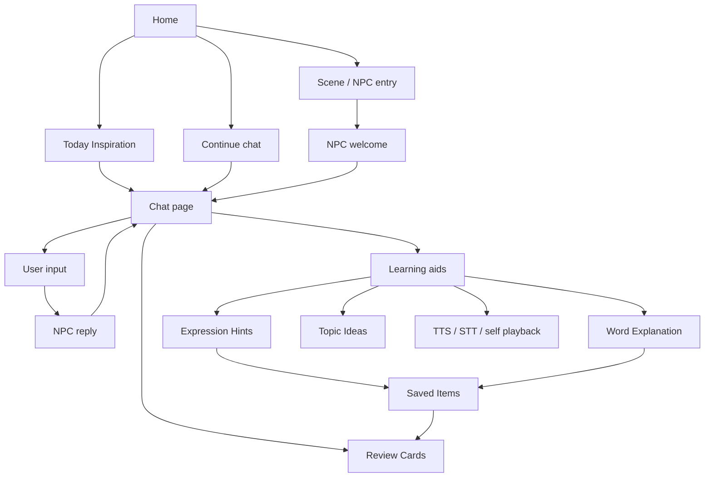
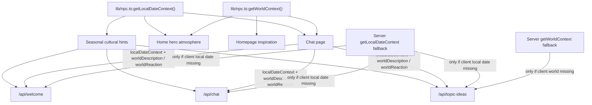
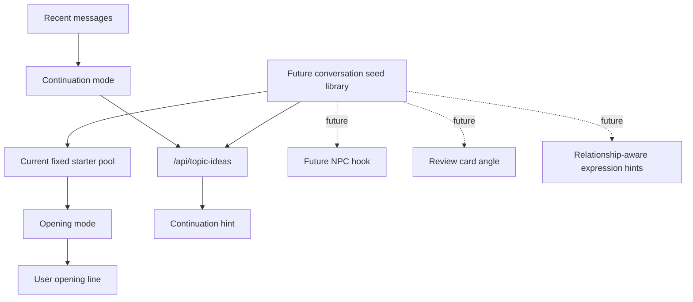
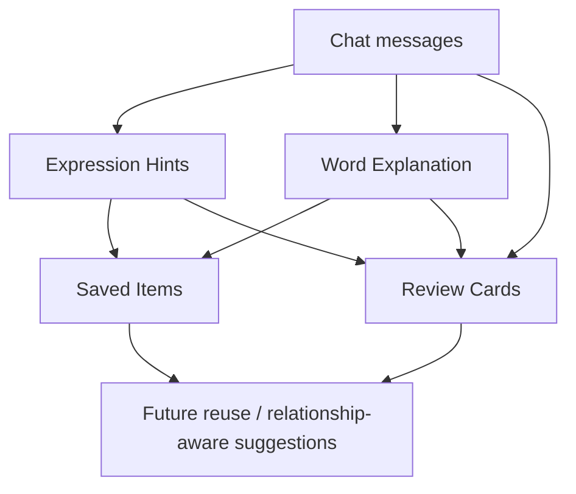

# Kotomachi System Map

## 1. Purpose

This document is the high-level system map for Kotomachi / 言街.

It is used to:

- record the main module relationships;
- prevent existing feature dependencies from being forgotten;
- help locate impact areas when adding NPCs, changing topic ideas, changing world state, or changing review cards;
- serve as a context entry point for ChatGPT / Codex / Trae collaboration.

This is not a detailed feature spec. It is a navigation map for the current product system.

## 2. Product Loop Overview

## 3. Core Module Map

| Module | User-facing role | Key files | Depends on | Risk / notes |
|---|---|---|---|---|
| Home page | Entry into the language town | `app/page.tsx`, `components/home/*` | `lib/npc.ts`, `lib/home-scenes.ts`, `lib/starter-prompts.ts`, LocalStorage recent chat | Homepage has hardcoded NPC info in multiple components. |
| Chat page | LINE-style NPC conversation surface | `app/chat/[npcId]/page.tsx` | NPC config, memory, localStorage, API routes, UI copy | This is the main integration point; avoid turning it into a learning dashboard. |
| NPC config | Names, avatars, life arcs, world state, card lines | `lib/npc.ts` | LocalStorage arc offset, date seed | Adding an NPC requires updates across several `Record<NpcId, ...>` maps. |
| Starter prompts / topic pool | Opening mode prompts and homepage inspiration | `lib/starter-prompts.ts` | NPC state, world state, date seed | Fixed starter pool should not hardcode weather unless supported by current world state. |
| Topic ideas API | Context-aware continuation suggestions | `app/api/topic-ideas/route.ts` | Recent messages, NPC scene hints, worldDescription / worldReaction | Client world state should be preferred; server `getWorldContext()` is fallback. |
| Chat API | NPC pure-Japanese reply | `app/api/chat/route.ts` | NPC prompt branch, memories, life arc, cross mentions, world state | Register drift and proactive teaching are core risks. |
| Welcome API | Initial / revisit greeting and fact extraction | `app/api/welcome/route.ts` | History, facts, recent assistant messages, life arc, world state | Must not repeat welcome or leak revisit tone into initial welcome. |
| Word explanation API | On-demand word lookup | `app/api/explain/route.ts` | Selected text, source sentence, UI language | Feeds recent lookups and saved words. |
| Expression hints | On-demand expression rewriting | `app/api/feedback/route.ts`, `components/chat-bubble.tsx` | User message, UI language, cache | Must stay auxiliary; not main-chat correction. |
| Review card API | Soft landing after short chat | `app/api/session-summary/route.ts`, `lib/session-summary.ts` | Recent messages, non-Japanese spans, recent lookups, recent expression hints | Should summarize evidence, not grade or fabricate. |
| Saved items | Saved words and expressions | `lib/saved-items.ts`, `components/saved-items-panel.tsx` | Word explanation, expression hints | Must survive start-over. |
| World state / life arc | Street atmosphere and NPC continuity | `lib/npc.ts` | Date seed, optional local arc offset | Used by home, welcome, chat, topic ideas. |
| localStorage | Browser-local memory and learning assets | `lib/memory.ts`, `lib/saved-items.ts`, `lib/session-summary.ts` | Browser availability | Schema compatibility matters; no account/database yet. |
| PWA / assets | Mobile app-like usage and visual identity | `public/*`, avatar paths in `lib/npc.ts` | Browser/PWA cache behavior | `` warnings and Edge PWA icon cache are known/deferred. |

## 4. World State Flow

Current decisions:

- Topic seeds are stable conversation skeletons.
- Seasonal cultural hints are optional cultural material derived from local month / season.
- World state is a weather / time / street atmosphere overlay.
- Local date context is the source of truth for year / month / day / weekday / weekend / time-of-day hard facts.
- Calendar facts such as weekday / weekend should not be randomized as atmosphere copy.
- Month, season, holiday, and seasonal-event references must come from local date context or explicit world state support, not model invention.
- Seasonal hints must not be asserted as real-time events unless world state or recent messages explicitly support them.
- Topic ideas should prefer `worldDescription` / `worldReaction` passed from the current page.
- Chat / welcome / topic ideas should prefer `localDateContext` passed from the current page.
- Server-side `getWorldContext()` is only a fallback for topic ideas when client world state is missing.
- Server-side `getLocalDateContext()` is only a fallback when client local date context is missing.
- Avoid writing fixed starter pool items that hardcode rainy / sunny states.
- Weather should be mentioned only when current world state or recent messages support it.
- Chat / welcome / topic ideas prompts should not contradict the provided world state.
- Chat / welcome / topic ideas prompts should not contradict the provided local date context.
- Do not anchor Kotomachi itself to real-world place names. Real place names are allowed when the user explicitly asks about travel, geography, or culture. Use general-knowledge framing and avoid real-time claims.

## 5. Topic Ideas / Conversation Seed Flow

Rules:

- Fixed starter pool is for opening mode.
- Context-aware topic ideas are for continuation mode.
- The topic pool should evolve toward a conversation seed library.
- Starter prompts are not the same as NPC hooks.
- Seed directions can support:
  - user opening line;
  - continuation hint;
  - future NPC hook;
  - review card angle;
  - relationship-aware expression hints.

## 6. NPC System Map

| npcId | Scene | Relationship | Register | Key learning value | Drift risk | Key files touched when adding NPC |
|---|---|---|---|---|---|---|
| `misaki` | Cafe | Light regular / gentle distance | Light polite | Quiet chat, cafe ordering, rest, light emotion | Teacher / counselor | `lib/npc.ts`, `lib/starter-prompts.ts`, home components, chat page, chat/welcome/topic APIs |
| `kimura` | Convenience store / night shift | Young familiar counter chat | Casual | Convenience store, night shift, daily rhythm, light complaints | Too cold, too short, generic | same |
| `taisho` | Izakaya | Regular / older shop owner | Regular-customer casual | End-of-day chat, food/drink, warm casual speech | Life coach / lecture | same |
| `haruka` | Lab / campus | Senpai / askable senior | Gentle polite | Lab, seminar, literature, study-abroad uncertainty | Professor / consultant / teacher | same |
| `aoi` | Student lounge / after-school | Same-age friend | Tameguchi | Hobbies, recommendations, friend-like casual speech | Romance, dependency, anime-like tone | same |

### NPC Integration Checklist

When adding an NPC, check:

- `lib/npc.ts`
- `lib/starter-prompts.ts`
- `lib/home-scenes.ts`
- `components/home/scene-entry-section.tsx`
- `components/home/inspiration-section.tsx`
- `components/home/continue-section.tsx`
- `app/chat/[npcId]/page.tsx`
- `app/api/welcome/route.ts`
- `app/api/chat/route.ts`
- `app/api/topic-ideas/route.ts`
- `app/api/session-summary/route.ts`
- saved items / review cards typing if needed
- avatar path
- homepage register label
- experience log
- docs / spec

Adding an NPC is not complete until it appears in scene entry, inspiration, continue/sidebar, welcome, chat, starters, topic ideas, and review/saved-compatible flows.

## 7. Learning Asset Flow

Notes:

- Saved Items and Review Cards should not be deleted by start-over.
- Start-over clears only current NPC chat and temporary memory.
- Word Explanation feeds recent lookups and saved words.
- Expression Hints feed possible saved expressions and recent hint signals.
- Review Cards provide soft landing, not formal grading.

## 8. State Ownership Table

| State / data | Source of truth | Used by | Storage | Notes |
|---|---|---|---|---|
| messages per NPC | `lib/memory.ts` helpers via chat page | Chat page, welcome, chat API, review cards | localStorage | Start-over clears current NPC chat. |
| welcome timing / last visit | chat page marker helpers | Initial / revisit welcome | localStorage + sessionStorage | Revisit welcome threshold is currently 2 hours. |
| local date context | browser local `Date`, server fallback | Home, welcome, chat, topic ideas | computed, no storage | Hard facts only: year/month/day/weekday/weekend/time of day. Do not randomize or let the model invent season/holiday facts. |
| seasonal culture hints | derived from local date context | welcome, chat, topic ideas | computed, no storage | Optional cultural material only; not real-time events or local event claims. |
| world state | `lib/npc.ts:getWorldContext()` | Home, chat page, welcome, chat, topic ideas | computed by date seed | Client-passed world state should drive APIs when available. |
| NPC life arc | `lib/npc.ts:getNpcState()` | Home card lines, welcome, chat, topic ideas | computed + optional localStorage arc offset | Cross mentions come from arc config. |
| starter prompts | `lib/starter-prompts.ts` | Chat starter chips, homepage inspiration, topic fallback | code constants | Opening mode only; future seed library source. |
| topic ideas cache | chat page `topicIdeasCacheRef` | `+ -> 找话题` continuation mode | in-memory React ref | Cache key includes NPC, UI language, recent messages hash. |
| saved items | `lib/saved-items.ts` | Saved panel, review signals, future reuse | localStorage | Should survive start-over. |
| review cards | `lib/session-summary.ts` | Review panel, history, soft landing | localStorage | Should survive start-over; duplicate protection uses source fingerprint. |
| UI language | `lib/ui-language.ts` | Home, chat, generated teaching text | localStorage | Japanese learning content remains Japanese where needed. |
| PWA assets / avatar paths | `public/*`, `lib/npc.ts:NPC_AVATARS` | Home cards, chat sidebar, continue section | static assets + browser cache | Edge/PWA icon cache issues are known/deferred. |

## 9. Current Risk Map

- World state client/server consistency.
- Topic seed vs world-state overlay.
- Opening mode vs continuation mode.
- Fixed starter pool vs AI-generated topic ideas.
- Welcome threshold / not repeating welcome.
- NPC register drift.
- Homepage hardcoded NPC info across multiple components.
- localStorage compatibility.
- Review Cards and Saved Items should survive start-over.
- `` warnings are known but currently deferred.

## 10. Maintenance Rules

- Every new NPC must update the NPC integration checklist.
- Every new API route must record which state it reads.
- Every world state change must check welcome / chat / topic ideas / inspiration.
- Do not randomize real calendar facts such as weekday / weekend into atmosphere copy unless they come from real current time.
- Seasonal references must be derived from local date context or explicit world state / recent message support.
- Seasonal hints cannot be asserted as happening events.
- Do not anchor Kotomachi to real-world place names. Real place names are allowed when the user explicitly asks about travel, geography, or culture, but avoid real-time claims.
- Every topic pool change must check opening fallback and topic ideas fallback.
- Every localStorage schema change must check migration / compatibility.
- Every homepage card structure change must check mobile and horizontal scroll.
- Do not write future directions as completed capabilities.

## 11. How to Use This Doc

- Read this system map before starting a new cross-module task.
- Reference the relevant section when prompting Codex / Trae / ChatGPT.
- If a new dependency is discovered, update this system map.
- Use this as a navigation map; go to the detailed spec files for exact behavior.
