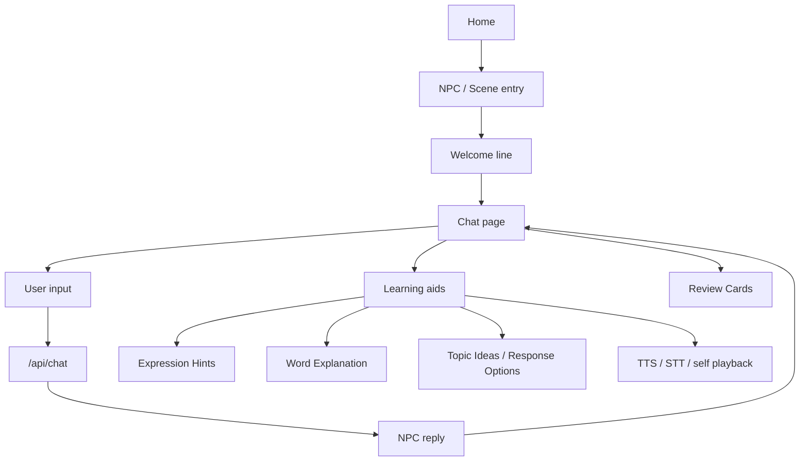

# Kotomachi System Map

## Purpose

Kotomachi 的 `system-map` 现在同时承担 AI Navigation Map / codegraph-lite 的作用。

这个文档的目的不是替代代码，而是帮助 ChatGPT / Codex / Trae 在动手前快速判断：

- 哪个功能主要落在哪些文件；
- 哪些 API route 负责什么；
- 哪些 UI 入口对应哪些代码；
- 哪些区域属于稳定区，不应顺手重写；
- 不同任务应该先读哪一小组文件，而不是反复扫全仓。

它的目标是：

- reduce repeated repo scanning;
- help AI agents choose the smallest relevant file set;
- make Codex / Trae prompts more precise;
- keep product boundaries visible;
- avoid accidental changes to stable systems.

明确规则：

```text
This document is a navigation aid, not the source of truth.
The actual code remains the source of truth.
```

## Product Loop Overview



## AI Navigation Map / Codegraph-lite

### Agent Usage Rules

```text
Before editing, identify the feature area.
Read only the primary files listed for that feature.
Do not scan the whole repo unless the task explicitly requires cross-cutting review.
Do not modify deferred zones.
Report files read, files changed, risks, and manual checks.
```

### Feature -> File Map

#### Home / Landing page

Primary files:
- `app/page.tsx`
- `components/home/scene-entry-section.tsx`
- `components/home/inspiration-section.tsx`
- `components/home/continue-section.tsx`

Supporting files:
- `lib/home-scenes.ts`
- `lib/home-continue.ts`
- `lib/npc.ts`
- `lib/starter-prompts.ts`

Notes / risks:
- Home 是产品入口，不应被改成 dashboard。
- NPC 卡片、继续聊天、灵感入口都从这里出发。
- Mainland access 与首页首屏资源通常先看这里。

#### NPC profile / character data

Primary files:
- `lib/npc.ts`

Supporting files:
- `docs/npc-spec-*.md`
- `lib/home-scenes.ts`
- `lib/starter-prompts.ts`
- `lib/conversation-scenes.ts`

Notes / risks:
- `lib/npc.ts` 是 NPC 基础配置中心：名字、头像、关系感、life arc、world state。
- 新 NPC 通常不是只改一个表，而是要检查多个 `Record<NpcId, ...>`。
- Nana 是现有稳定 NPC，不要顺手改定位。

#### Chat page

Primary files:
- `app/chat/[npcId]/page.tsx`

Supporting files:
- `components/chat-bubble.tsx`
- `lib/memory.ts`
- `lib/client-api-url.ts`
- `lib/ui-copy.ts`
- `lib/ui-language.ts`

Notes / risks:
- 这是主集成点，串起 welcome、chat、topic ideas、TTS、STT、review。
- 不要把 chat page 变成教学控制台。

#### Chat API

Primary files:
- `app/api/chat/route.ts`

Supporting files:
- `lib/llm.ts`
- `lib/npc.ts`
- `lib/conversation-scenes.ts`

Notes / risks:
- 核心职责是让 NPC 用自然日语继续对话。
- 风险是 register drift、主动教学、虚构 shared memory、破坏场景软上下文。

#### STT

Primary files:
- `app/api/stt/route.ts`

Supporting files:
- `lib/volcengine.ts`
- `app/chat/[npcId]/page.tsx`

Notes / risks:
- Provider route，稳定区。
- 不要把 STT 错误直接包装成用户语言错误。

#### TTS

Primary files:
- `app/api/tts/route.ts`

Supporting files:
- `lib/volcengine.ts`
- `lib/edge-tts.ts`
- `lib/tts-text.ts`
- `components/chat-bubble.tsx`
- `app/chat/[npcId]/page.tsx`

Notes / risks:
- Provider route，稳定区。
- `auto -> volc -> edge` 的 fallback 不要随手改坏。

#### Expression Hints

Primary files:
- `app/api/feedback/route.ts`
- `components/chat-bubble.tsx`

Supporting files:
- `app/chat/[npcId]/page.tsx`
- `lib/feedback-types.ts`
- `lib/expression-hint-cache.ts`
- `lib/session-summary.ts`

Notes / risks:
- Stable system.
- Do not reconnect `activeScene` unless explicitly requested.
- Do not allow failed fallback hints to become saveable / playable / reviewable.
- 用户可见日语不要混入 emoji、markdown、装饰文本。

#### Topic Ideas / Response Options

Primary files:
- `app/api/topic-ideas/route.ts`

Supporting files:
- `app/chat/[npcId]/page.tsx`
- `lib/starter-prompts.ts`
- `lib/conversation-scenes.ts`
- `lib/npc.ts`

Notes / risks:
- opening mode 和 continuation mode 不同，不要混成一个东西。
- Guided Scenario 下它更像 response options，不是泛话题推荐。

#### Guided Scenarios

Primary files:
- `lib/conversation-scenes.ts`
- `app/chat/[npcId]/page.tsx`

Supporting files:
- `app/api/chat/route.ts`
- `app/api/topic-ideas/route.ts`
- `docs/guided-scenarios-v0.md`

Notes / risks:
- `activeSceneId` 是 soft context，不是任务状态机。
- 不要做 completion、评分、课程化流程。
- 不要为了场景改坏自由聊天。

#### Review Cards / session summary

Primary files:
- `app/api/session-summary/route.ts`
- `lib/session-summary.ts`

Supporting files:
- `components/chat-summary-list.tsx`
- `components/chat-summary-detail.tsx`
- `components/chat-bubble.tsx`

Notes / risks:
- Stable extraction boundary.
- Review 是 soft landing，不是 grading。
- 只能总结真实 evidence，不能 fabricate。

#### Word explanation

Primary files:
- `app/api/explain/route.ts`
- `components/chat-bubble.tsx`

Supporting files:
- `lib/saved-items.ts`

Notes / risks:
- 代码中的真实 route 是 `/api/explain`，不是 `/api/word-explanation`。
- 这是按需查词，不应扩展成主动教学流。

#### Nana NPC

Primary files:
- `lib/npc.ts`

Supporting files:
- `docs/npc-spec-nana.md`
- `lib/starter-prompts.ts`
- `lib/conversation-scenes.ts`
- `app/api/chat/route.ts`
- `app/api/topic-ideas/route.ts`

Notes / risks:
- Nana 是 life-support / newcomer-support NPC。
- 不要把 Nana 改成行政工具、翻译工具或办事窗口机器人。

#### Voice Advice disabled spike

Primary files:
- `app/api/voice-advice/route.ts`
- `lib/voice-advice-types.ts`

Supporting files:
- `docs/voice-advice-v0.md`

Notes / risks:
- Disabled experimental spike.
- Must not be exposed in UI or production.
- 不要把它并回 Expression Hints 或 Review Card 链路。

#### Vercel Analytics

Primary files:
- `app/layout.tsx`

Supporting files:
- `package.json`

Notes / risks:
- Analytics 是可选脚本，不应影响主功能。
- 大陆访问相关任务里通常只需确认它是否为非阻塞依赖。

#### Mainland access / assets

Primary files:
- `app/page.tsx`
- `app/layout.tsx`
- `lib/npc.ts`
- `public/`

Supporting files:
- `next.config.mjs`
- `app/globals.css`

Notes / risks:
- 这类任务通常只读首页、头像、PWA 路径和静态资源引用。
- 不要顺手改 chat logic、provider route、env 配置。

### API Route Map

#### `/api/chat`

- Purpose: 生成 NPC 主聊天回复，保持自然日语和角色感。
- Input / output: 输入用户文本、npcId、history、memories、localDateContext、world state、可选 `activeSceneId`；输出一条 NPC 文本回复。
- Related features: Chat page, Guided Scenarios, world state, NPC life arc.
- High-risk notes: 不要主动纠错；不要虚构过去对话；不要破坏 soft scene context。

#### `/api/feedback`

- Purpose: 生成 Expression Hints 三档表达及解释。
- Input / output: 输入用户原句、npcId、UI language；输出 casual / business / formal 建议结构。
- Related features: Expression Hints, saved expressions, session summary signals.
- High-risk notes: 失败 fallback 不能进入可保存 / 可播放 / 可复盘链路。

#### `/api/topic-ideas`

- Purpose: 生成 continuation hints 或 scenario-aware response options。
- Input / output: 输入 recent messages、npcId、world state、可选 `activeSceneId`；输出 idea 列表。
- Related features: Topic Ideas, Guided Scenarios, homepage inspiration fallback.
- High-risk notes: 不要把场景中的 response options 退化成泛话题推荐。

#### `/api/stt`

- Purpose: 识别用户录音，返回文本。
- Input / output: 输入音频 `multipart/form-data`；输出 transcript 或错误信息。
- Related features: Voice input, chat submit, future voice-side features.
- High-risk notes: Provider route；不要把 provider 问题包装成语言教学判断。

#### `/api/tts`

- Purpose: 合成 NPC 或学习辅助语音。
- Input / output: 输入文本和 `npcId`；输出 `audio/mpeg`。
- Related features: NPC playback, Expression Hints playback, word explanation playback.
- High-risk notes: Provider fallback 稳定区；不要随手改掉 `volc -> edge` 兜底逻辑。

#### `/api/explain`

- Purpose: 当前实际的 word explanation route。
- Input / output: 输入选中文本、完整句子、UI language；输出词义、句内解释、细微语感信息。
- Related features: Word explanation, saved words.
- High-risk notes: 真实 route 名是 `/api/explain`；文档或任务里提到 `/api/word-explanation` 时要先对齐代码现状。

#### `/api/session-summary`

- Purpose: 生成 Review Cards / session summary。
- Input / output: 输入最近消息和学习辅助 evidence；输出 summary card 数据。
- Related features: Review Cards, chat summary list/detail, saved learning continuity.
- High-risk notes: 只能用真实 evidence；不要变成考试评分或 fabricated study notes。

#### `/api/voice-advice`

- Purpose: Voice Advice spike route，用于验证 audio-aware speaking feedback 方向。
- Input / output: 输入音频、可选 transcript / npcId / UI language；输出 voice advice 结构或禁用态错误。
- Related features: Voice Advice spike only.
- High-risk notes: `/api/voice-advice` is an experimental disabled spike and should not be exposed in UI or production.

### UI Entry Map

- Home page:
  `app/page.tsx`
- NPC selection / NPC cards:
  `components/home/scene-entry-section.tsx`
- Continue chat:
  `components/home/continue-section.tsx`
- Inspiration / starter entry:
  `components/home/inspiration-section.tsx`
- Chat page shell:
  `app/chat/[npcId]/page.tsx`
- User message bubble:
  `components/chat-bubble.tsx`
- NPC message bubble:
  `components/chat-bubble.tsx`
- `+` menu and learning aid actions:
  `app/chat/[npcId]/page.tsx`, `components/chat-bubble.tsx`
- Expression Hints panel:
  `components/chat-bubble.tsx`
- Topic Ideas / Response Options:
  `app/chat/[npcId]/page.tsx`, `/api/topic-ideas`
- Guided Scenario entry / exit:
  `app/chat/[npcId]/page.tsx`, `lib/conversation-scenes.ts`
- Review Card soft landing:
  `components/chat-summary-list.tsx`, `components/chat-summary-detail.tsx`, `/api/session-summary`

### Stable / Risky Zones

#### Stable zones

- Expression Hints fallback / validation / saveability logic
- Guided Scenarios soft-context behavior
- Review Card extraction boundaries
- STT / TTS provider routes
- custom domain / Vercel config assumptions

#### Deferred zones

- Voice Advice UI
- Azure production env
- quota system
- login / database
- activeScene-aware Expression Hints
- large onboarding
- domestic CDN / EdgeOne / 备案

### Task Context Recipes

#### 修改 NPC 文案 / 新 NPC

Read:

- `lib/npc.ts`
- relevant `docs/npc-spec-*.md`
- optionally `lib/conversation-scenes.ts`

Do not read:

- API routes unless behavior changes are requested.

#### 修改 Guided Scenarios

Read:

- `docs/guided-scenarios-v0.md`
- `lib/conversation-scenes.ts`
- `app/api/topic-ideas/route.ts`
- `app/api/chat/route.ts`
- `app/chat/[npcId]/page.tsx`

Do not touch:

- Expression Hints unless explicitly requested.

#### 修改 Expression Hints

Read:

- `app/api/feedback/route.ts`
- `components/chat-bubble.tsx`
- `app/chat/[npcId]/page.tsx`

Warning:

- Avoid `activeScene` coupling.
- Avoid emoji / markdown / decorative text in user-facing Japanese.

#### Mainland access / image optimization

Read:

- `app/page.tsx`
- `app/layout.tsx`
- `lib/npc.ts`
- relevant `public/` assets

Do not touch:

- API routes
- chat logic
- package / env files

#### Voice Advice

Read:

- `docs/voice-advice-v0.md`
- `app/api/voice-advice/route.ts`
- `lib/voice-advice-types.ts`

Warning:

- Disabled experimental spike.
- Do not expose UI.
- Do not configure production.

#### Chat API behavior change

Read:

- `app/api/chat/route.ts`
- `app/api/welcome/route.ts`
- `lib/llm.ts`
- `lib/npc.ts`
- optionally `lib/conversation-scenes.ts`

Warning:

- Protect pure-Japanese NPC reply behavior.
- Protect non-teacher boundary.

#### Review Card / session summary

Read:

- `app/api/session-summary/route.ts`
- `lib/session-summary.ts`
- `components/chat-summary-list.tsx`
- `components/chat-summary-detail.tsx`

Warning:

- Preserve soft landing behavior.
- Do not turn summaries into grading or correction reports.

## Current Risk Map

- Chat page is still the highest coupling surface.
- `lib/npc.ts` remains a central config hub; NPC changes are rarely single-file.
- Guided Scenario, Topic Ideas, and Chat API share `activeScene` assumptions.
- Expression Hints, Saved Items, and Review Cards have hidden downstream coupling.
- Route naming mismatch exists at the doc/task language level: product language says "Word Explanation", actual route is `/api/explain`.
- Voice Advice route exists in code but is intentionally disabled for product use.

## Maintenance Rule

- 每新增一个功能或大改一个功能，都应更新 `docs/system-map.md` 的对应条目。
- 至少补充这四类信息：feature、primary files、supporting files、notes / risks。
- 如果新增 route、UI 入口或稳定区边界，也应同步更新对应 map。
- 这个文档保持轻量、实用、可快速定位，不写成重型架构文档。
