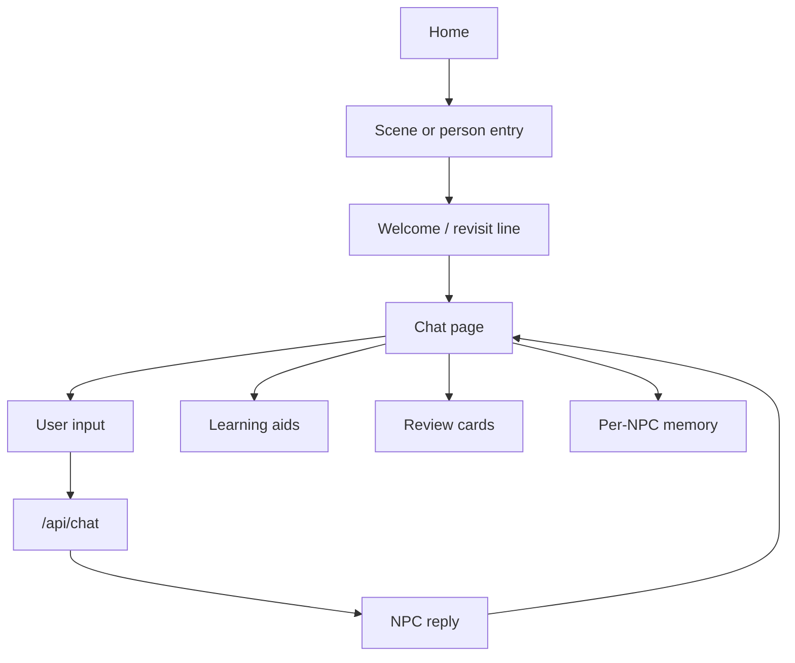

# Kotomachi System Map

## Purpose

`docs/system-map.md` 是 Kotomachi 的轻量导航图。
它的目标不是替代代码，而是帮助维护者和 Codex 快速判断：

- 当前功能主要落在哪些文件；
- 哪些页面和 API 负责什么；
- 哪些区域已经稳定，应该尽量小改；
- 做某类任务时应该先读哪一小组文件。

规则：

```text
This document is a navigation aid, not the source of truth.
The actual code remains the source of truth.
```

## Agent usage rules

```text
Before editing, identify the feature area.
Read only the smallest relevant file set.
Avoid scanning the whole repo unless the task is explicitly cross-cutting.
Prefer small, reversible changes.
Report files read, files changed, risks, and manual checks.
```

## Product loop overview



## Feature map

### Home / landing page

Primary files:

- `app/page.tsx`
- `components/home/ambient-whisper-strip.tsx`
- `components/home/scene-entry-section.tsx`
- `components/home/inspiration-section.tsx`
- `components/home/continue-section.tsx`
- `components/home/rumor-entry.tsx`

Supporting files:

- `lib/home-scenes.ts`
- `lib/home-continue.ts`
- `lib/ambient-whispers.ts`
- `lib/rumor-gate.ts`
- `lib/npc.ts`

Notes:

- 首页应保持轻量，以进入聊天为主。
- 首页不再直接暴露 Memory Center 入口。
- 不要把首页改成设置页或后台管理页。

### Chat page

Primary files:

- `app/chat/[npcId]/page.tsx`

Supporting files:

- `components/chat-bubble.tsx`
- `components/npc-memory-panel.tsx`
- `lib/memory.ts`
- `lib/ui-copy.ts`
- `lib/ui-language.ts`
- `lib/conversation-scenes.ts`

Notes:

- 这是主集成点，串起 welcome、chat、memory、topic ideas、TTS、STT、review。
- 当前 NPC memory panel 是 memory v0 的主入口。
- 当前 session 内的 memory curator 触发逻辑也在这里。

### Expression Hint

Primary files:

- `app/api/feedback/route.ts` — generation API and provider/fallback handling
- `lib/feedback-types.ts` — response and note types
- `lib/expression-hint-cache.ts` — local cache for expression hints
- `components/chat-bubble.tsx` — drawer/card UI and save action
- `components/saved-items-panel.tsx` — saved item detail rendering
- `lib/saved-items.ts` — saved item storage and types

Data flow:

1. User selects or opens Expression Hint from a chat message.
2. Client calls `/api/feedback`.
3. API returns three levels plus optional shared notes and structure notes.
4. Feedback drawer renders:
   - original text;
   - core fixes (`sharedRevisionNotes`);
   - three suggested expressions;
   - usage (`usage`) for each level;
   - level-specific notes (`revisionNotes`);
   - reusable pattern (`structureNote`) inside expanded explanation.
5. User may save one selected level.
6. Saved item stores the selected level plus relevant explanation data.
7. Saved items panel can show the saved expression with original text and learning notes.

Current status:

- Three-level semantics implemented: Casual / Neutral / Polite.
- Internal keys may still be `casual` / `business` / `formal`; `business` maps to Neutral and `formal` maps to Polite.
- `sharedRevisionNotes` highlights core fixes in the original expression.
- `usage` explains when to use each level.
- `revisionNotes` explains level-specific register differences.
- `structureNote` is shown inside expanded explanation, not as always-visible content.
- Provider failure / fallback handling prevents failed generation from appearing as a normal learning card.
- Fallback results are not cached; `forceRefresh` bypasses cache.
- Previous `learningPoints` design has been removed.

Known deferred items:

- `structureNote` is not currently cached in Expression Hint cache.
- Some visible level labels may still use earlier wording; can be copy-polished later to Casual / Neutral / Polite: 亲近随和 / 普通自然 / 礼貌得体.

### Review cards

Primary files:

- `app/chat/[npcId]/page.tsx` — trigger review card creation and save the generated card
- `app/api/session-summary/route.ts` — normalize model output and merge lookup / conversation evidence
- `components/chat-summary-detail.tsx` — right-side review card list and detail rendering
- `lib/session-summary.ts` — review card and lookup-history types plus localStorage helpers
- `components/word-popover.tsx` — saves lookup history that review cards can reuse

Data flow:

1. User looks up a word from chat in `components/word-popover.tsx`.
2. Lookup history stores `meaning`, optional `sentenceMeaning`, and `sourceSentence`.
3. Chat page sends recent lookups into `/api/session-summary`.
4. Session summary route merges lookup-backed words and conversation-picked words into `reviewWords`.
5. Review card detail renders lookup words with context-first priority when those optional fields exist.

### Memory system v0

Primary files:

- `lib/memory.ts`
- `components/npc-memory-panel.tsx`
- `components/npc-memory-center.tsx`
- `app/api/memory/route.ts`

Related files:

- `app/api/chat/route.ts`
- `app/api/welcome/route.ts`
- `app/memories/page.tsx`
- `lib/npc.ts`

Current storage keys:

- `kotomachi_facts_${npcId}`
- `kotomachi_history_${npcId}`
- `kotomachi_count_${npcId}`
- `kotomachi_last_time_${npcId}`

Current status:

- per-NPC localStorage memory is implemented;
- current NPC panel is implemented in chat page;
- all-residents memory view is available inside the NPC memory panel;
- `/memories` route still exists, but is not the primary UX entry;
- homepage no longer exposes Memory Center directly.

Memory utility layer:

- `getLocalNPCMemories(npcId)`
- `deleteLocalNPCMemory(npcId, index)`
- `clearLocalNPCMemories(npcId)`
- `applyLocalNPCMemoryCuratorResult(npcId, result)`

Memory curator:

- `app/api/memory/route.ts`
- input centers on `npcId`, `recentMessages`, `existingMemories`
- output supports `ignore`, `add`, `replace`

Prompt injection:

- `app/api/chat/route.ts`
- injects current NPC memories only
- capped at max 5
- includes anti-romance / anti-dependency / sensitive-context caution

Important boundaries:

- v0 still uses `string[]` facts as visible durable memories;
- temporary context should stay in chat history rather than memory panel;
- no global memory;
- no cross-NPC memory sharing;
- no manual add or edit.

### Memory UI surfaces

Primary files:

- `components/npc-memory-panel.tsx`
- `components/npc-memory-center.tsx`
- `app/memories/page.tsx`

Current UX:

- chat page opens current-person memory panel first;
- panel can switch to in-panel all-residents view;
- `/memories` is retained, but is not the main mental model anymore;
- user-facing copy should prefer “街上的人 / 这个人 / 其他人 / 具体名字”;
- avoid user-facing “居民 / NPC / 亲密度 / 好感度 / 羁绊 / 想你 / 关系升级”.

### Chat API

Primary file:

- `app/api/chat/route.ts`

Supporting files:

- `lib/llm.ts`
- `lib/npc.ts`
- `lib/conversation-scenes.ts`

Notes:

- 核心职责是让 NPC 用自然日语继续对话。
- 只读取当前 NPC 的 memories，不跨 NPC 注入。
- memory block 只在有 memory 时注入。

### Chat Prompt Assembly / NPC Runtime Context

Primary files:

- `app/api/chat/route.ts`
- `lib/llm.ts`
- `lib/conversation-scenes.ts`
- `scripts/sample-guided-response-traces.local.mjs`

这个章节记录 NPC chat prompt assembly / runtime context 的实际链路。以后如果要查 guided scenario 为什么没有生效、为什么 persona 抢权、或者想手动调整 prompt，应优先从这里开始。

Call chain:

```text
Client chat UI / sampler
→ POST /api/chat
→ request body: text, npcId, history, memories, activeSceneId, conversationCount, lifeArc, localDateContext, etc.
→ resolveLocalDateContext()
→ getPromptMemories()
→ buildScenePrompt(activeSceneId, history.length)
→ buildSystemPrompt(npcId, memories, conversationCount, ...)
→ shared safety / conversational baseline layer
→ assemble messages
→ createChatCompletion(messages)
→ provider payload
```

Current final messages structure:

```ts
[
  { role: "system", content: npcSystemPrompt },
  { role: "system", content: sharedSafetyPrompt },
  ...(scenePrompt ? [{ role: "system", content: scenePrompt }] : []),
  ...(history ?? []),
  { role: "user", content: text },
]
```

各层含义：

- `npcSystemPrompt`
  - NPC persona、voice、memory / date / familiarity / world context。
  - 某些 NPC 会走专用 block，例如 `aoiSystemPrompt`、`rikuSystemPrompt`、`sakuSystemPrompt`。
- `sharedSafetyPrompt`
  - 共享世界规则与安全边界。
  - 当前实现里，global conversational baseline 是和这一层拼在一起发送的，而不是单独新增一个 system message。
- `scenePrompt`
  - guided scenario soft context。
  - 包含 scene title / setup，以及 `starterIntent`、`microEpisode`、`avoid`、first-turn continuation rule。
- `history`
  - 已有聊天记录。
  - 在 guided scenario 默认链路里，通常只包含一条 `assistant` role 的 `npcOpening`。
- `text`
  - 当前用户输入。
  - guided scenario 默认链路里通常就是 `sampleUserLineJa`。

Guided scenario prompt logic:

- 只有 `activeSceneId` 存在时，route 才会尝试生成 `scenePrompt`。
- `activeSceneId` 应对应 `lib/conversation-scenes.ts` 中的 scene id。
- `buildScenePrompt(activeSceneId, history.length)` 会把 scene metadata 转成 soft context。
- `history.length <= 1` 时，视为 first guided turn。
- sampler / guided scenario 默认链路里：
  - `history.length` 通常是 `1`
  - `history[0]` 通常是 `assistant` role 的 `npcOpening`
- first guided turn 时会注入更强的 high-level continuation rule：
  - 不要太快关掉场景
  - 用户下一句要容易接
- `scene.avoid`、`starterIntent`、`microEpisode` 当前都会进入 `scenePrompt`。
- `sampleUserLineJa` 不会单独注入 prompt，因为当前 `user` message 本身就是用户实际发送内容。

运行时常见 request 字段：

- `text`
- `npcId`
- `history`
- `memories`
- `activeSceneId`
- `conversationCount`
- 其他上下文字段：
  - `lifeArc`
  - `lifeArcState`
  - `crossMentions`
  - `localDateContext`
  - `worldDescription`
  - `worldReaction`

Provider payload 结论：

- runtime prompt snapshot 已确认：`scenePrompt` 确实到达 route runtime messages。
- `lib/llm.ts` 当前不会吞掉最后一个 system message，也不会把多个 system messages 压扁成单条字符串。
- DeepSeek / Volc Ark 的 payload preview 都保留了：
  - message order
  - 全部 system messages
  - `scenePrompt` 这一层
- 因此，如果 NPC response 仍违背 `scenePrompt`，优先怀疑 prompt competition / persona conflict，而不是 sampler / route / provider 丢参。

Debug / eval tools:

- `scripts/sample-guided-response-traces.local.mjs`
  - 用于根据 input traces 或 scene source 调 `/api/chat` 采样 response。
  - 关键是保证 `activeSceneId`、`history`、`text` 正确传入。
  - filled output 应保留 input metadata。
- `debugPromptOnly: true`
  - `app/api/chat/route.ts` 中的 dev-only 调试入口。
  - 返回 prompt snapshot，不调用外部 LLM。
  - production 不应暴露。
- `scripts/debug-guided-prompt-snapshot.local.mjs`
  - 本地生成 runtime prompt snapshot。
  - 用于检查 route-level messages 和 provider payload preview。
- `.tmp/eval/guided-scenarios/prompt-audit/*`
  - 这些是临时审计资料，不是长期主文档。
  - 长期维护请回看本 system map，再按需翻对应 audit 文件。

Manual editing notes:

- 全局 NPC conversational baseline：
  - `app/api/chat/route.ts`
  - 优先看 base prompt / shared safety / conversational baseline 所在区域
- NPC persona：
  - 同一文件里的 `buildSystemPrompt()` 与 NPC-specific prompt block
- guided scenario 数据：
  - `lib/conversation-scenes.ts`
- scenePrompt assembly：
  - `buildScenePrompt()` in `app/api/chat/route.ts`
- provider payload：
  - `lib/llm.ts`
- sampler / debug 工具：
  - `scripts/*.local.mjs`

维护原则：

- 不要把所有 bad case 都写成新的 system prompt 分支。
- case-specific guardrail 优先放在 scene `avoid`。
- 跨场景的产品体验原则优先放在 NPC conversational baseline。
- 如果 response 与 prompt 预期不一致，先查 runtime prompt snapshot，再改 prompt。

### Welcome and revisit logic

Primary file:

- `app/api/welcome/route.ts`

Supporting files:

- `lib/npc.ts`
- `lib/memory.ts`

Notes:

- welcome 会参与 history-based facts merge；
- welcome 不应绕过 memory curator 的 durable-memory 边界；
- 不应把 food/order/weather/current mood 之类的临时碎片重新塞回 memories。

### NPC data

Primary file:

- `lib/npc.ts`

Notes:

- `lib/npc.ts` 是人物基础配置中心；
- 新增或调整人物时，优先复用统一 NPC 列表，避免旧硬编码列表漏项。

## Saku hidden rule

Saku 应保持隐藏人物规则：

- 不出现在首页普通 NPC section；
- `/chat/saku` 可以直接进入；
- 在 memory panel 的 all-residents view 或 `/memories` 中，不应无条件暴露；
- 只有在已发现 / 有 history / 有 count / 有 last_time / 有 memories 时才展示。

## Stable vs risky zones

相对稳定：

- `lib/npc.ts`
- `app/api/chat/route.ts` 的核心对话边界
- TTS / STT provider routes
- review / saved items 已成型的基础行为

相对敏感：

- `app/chat/[npcId]/page.tsx`，因为它串了很多状态
- `lib/memory.ts`，因为会影响 localStorage 数据行为
- `app/api/memory/route.ts`，因为会影响 memory 质量
- `app/api/welcome/route.ts`，因为可能重新引入低质量 memories

## Small file sets by task

做 memory UI 文案或交互：

- `components/npc-memory-panel.tsx`
- `components/npc-memory-center.tsx`
- `app/chat/[npcId]/page.tsx`

做 memory 保存 / 删除 / clear 行为：

- `lib/memory.ts`
- `components/npc-memory-panel.tsx`

做 memory curator / extraction：

- `app/api/memory/route.ts`
- `lib/memory.ts`
- `app/chat/[npcId]/page.tsx`
- `app/api/welcome/route.ts`

做 prompt injection：

- `app/api/chat/route.ts`
- `lib/memory.ts`
- `docs/memory-system-v0.md`

做首页入口相关：

- `app/page.tsx`
- `components/home/*`
- `lib/npc.ts`

## Current memory status note

Memory System v0 当前应理解为：

- 已实现；
- 仍在 QA；
- 重点是 per-NPC visible durable memories；
- 不是全局用户画像；
- 不是关系养成系统；
- 后续主要工作是 bad-case 收集、curator 评估和是否需要 schema v1。
